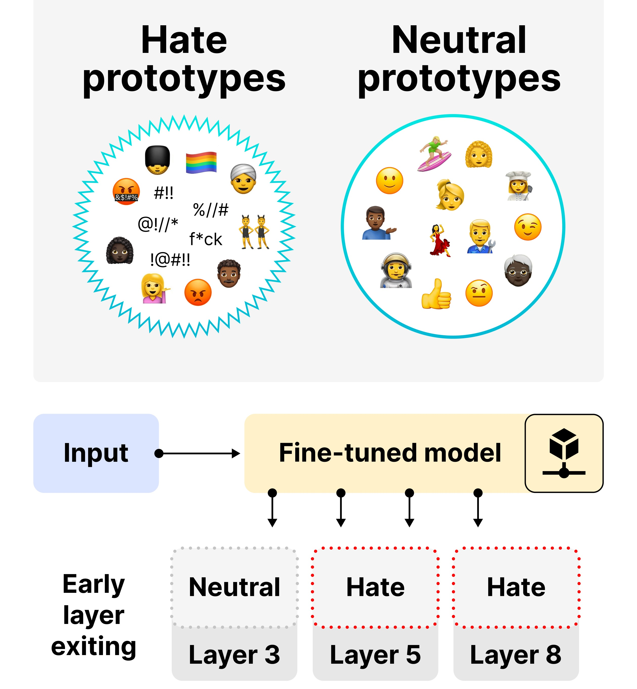

# HatePrototypes: Interpretable and Transferable Representations for Hate Speech Detection

This repository accompanies the paper:

**[HatePrototypes: Interpretable and Transferable Representations for Implicit and Explicit Hate Speech Detection](https://arxiv.org/abs/2511.06391)**  
*Irina Proskurina, Marc-Antoine Carpentier, Julien Velcin*

---
<p align="center">
  
</p>


---
> Current approaches to hate speech detection, particularly for implicit or indirect expressions of hate, often depend on repeated pre-training or fine-tuning of large language models on newly collected datasets. Explicit hate is typically identifiable through surface cues, but implicit hate requires deeper contextual processing, which makes traditional supervised adaptation expensive and dataset-dependent.  
>  
> We introduce **HatePrototypes**, class-level vector representations derived from models optimized for hate speech detection and safety moderation. These prototypes, obtained from as few as 50 labeled examples per class, enable robust cross-dataset transfer between explicit and implicit hate benchmarks. We show that prototypes are modular, interchangeable across datasets, and allow parameter-free early exiting and classification without task-specific fine-tuning.

---


## Dependencies

Required libraries:
```
pip install torch transformers datasets pandas sklearn-pandas numpy scikit-learn
````

Code was tested with:

* `torch==2.8.0+cu126`
* `transformers==4.57.0`
* `datasets==4.0.0`
* `pandas==2.2.2`
* `sklearn-pandas==2.2.0`
* `numpy==2.0.2`

---

## Datasets

We use the following 4 hate-speech benchmarks:
1. HateXplain
2. SBIC
3. IHC (Implicit Hate Corpus/LatentHatred)
4. OLID

All the datasets with `_train` and `_test` used in the paper are provided in: `all_data_hate.zip`.

## Fine-Tuning Models

### Encoder-only Models (BERT)

```
python model_finetuning.py \
  --hf_username iproskurina \
  --model_name bert-base-cased \
  --datasets hatexplain,olid,ihc,sbic \
  --text_col sentence \
  --label_col label
```

### Decoder-only Models (OPT)

```
python model_finetuning_opt.py \
  --model_name facebook/opt-125m \
  --datasets sbic \
  --text_col sentence \
  --label_col label \
  --push_to_hub \
  --hf_username iproskurina
```

To upload models to HuggingFace Hub, use these arguments in the training scripts:

```
--push_to_hub --hf_username <your_username>
```

---

## Prototype Extraction and Transfer
HatePrototypes are class-level vectors computed from the last-layer representations of a fine-tuned model, with one prototype per class. 
We use two settings: 

- (1) **Cross-domain transfer**, where prototypes and evaluation samples come from the same dataset but the encoder may be fine-tuned on a different dataset. 
- (2) **Prototype-based transfer**, where the encoder is fine-tuned and evaluated on the same dataset, while prototypes are built from another dataset.

## Cross-Domain Transfer Scripts

Use these scripts to run **cross-domain transfer** with class prototypes. In this setting, prototypes and evaluation samples come from the same dataset, while the encoder can be fine-tuned on a different dataset. 
The scripts load the specified fine-tuned models, build prototypes per dataset (up to `--max_protos` per class), and save prediction files for all prototype-to-evaluation combinations:

### BERT-based Prototypes

```
python hate_prototypes_bert.py \
    --datasets hatexplain olid sbic ihc \
    --pairs olid-ihc olid-hatexplain sbic-olid ihc-sbic \
    --model_pattern "iproskurina/bert-base-cased-{ds}-s{seed}" \
    --seeds 0 1 2 3 4 5 6 7 8 9 \
    --csv_train "{ds}_train.csv" \
    --csv_test "{ds}_test.csv" \
    --batch_size 8 \
    --max_length 500 \
    --max_protos 500 \
    --fp16 \
    --save_protos \
    --out_dir results-eval-bert
```
### OPT-based Prototypes

```
python hate_prototypes_opt.py \
    --datasets hatexplain olid sbic ihc \
    --seeds 0 1 2 3 4 5 6 7 8 9 \
    --model_pattern "iproskurina/opt-125m-{ds}-s{seed}" \
    --csv_train "{ds}_train.csv" \
    --csv_test "{ds}_test.csv" \
    --text_col sentence \
    --label_col label \
    --batch_size 8 \
    --max_length 500 \
    --max_protos 500 \
    --fp16 \
    --save_protos \
    --out_dir predictions-opt-full-protos
```


## Prototype-Based Transfer and Heatmap Generation

To aggregate prediction files and generate cross-dataset macro-F1 heatmaps, run:

```
python analyze_prototype_transfer.py \
    --models bert opt \
    --datasets hatexplain ihc sbic olid \
    --seeds 0 1 2 3 4 5 6 7 8 \
    --proto_dir "predictions-{model}-full-protos" \
    --relative \
    --out_pdf bert_opt_transfer.pdf
```

The --relative flag normalizes each cell by the model’s in-domain macro-F1 score (i.e., the diagonal value).


## Guardrail / Safety Models (BloomZ-3B-Guardrail)

To evaluate of safety-tuned models using prototypes, run:

```
python prototypes_guardrail.py \
    --datasets hatexplain olid sbic ihc \
    --seeds 0 1 2 3 4 \
    --model_name cmarkea/bloomz-3b-guardrail \
    --max_protos 500 \
    --max_length 500 \
    --batch_size 8 \
    --fp16 \
    --save_protos \
    --out_dir predictions-bloomz-full-protos
```

---
## Early Exiting

Early-exit baselines are implemented using the scripts in the `deebert/` directory  
(and `deeopt/` for OPT).

This section provides commands to evaluate three baselines:

1. **DeepBERT** (entropy-based early exit for BERT)
2. **DeepOPT** (entropy-based early exit for OPT)
3. **PaBEE-BERT** (patience-based early exit)
4. **PaBEE-OPT** (patience-based early exit for OPT)


### DeepBERT (Entropy-based)

Run entropy-threshold sweeps for BERT models:

```bash
for dataset in hatexplain ihc olid sbic; do
  for seed in 0 1 2 3 4; do
    sdir="./deebert-s${seed}-${dataset}/"
    for entropy in 0 0.1 0.2 0.3 0.4 0.5 0.6 0.7 0.8 0.9 1; do

      python deebert/deebert_finetune.py \
        --model_type bert \
        --model_name_or_path "${sdir}" \
        --task_name "${dataset}" \
        --do_eval \
        --data_dir "./" \
        --output_dir "${sdir}" \
        --plot_data_dir "./plotting/" \
        --max_seq_length 500 \
        --early_exit_entropy "${entropy}" \
        --per_gpu_eval_batch_size 1

    done
  done
done
````

### DeepOPT (Entropy-based)

Run entropy-threshold sweeps for OPT models:

```bash
for dataset in sbic hatexplain; do
  for seed in 0 1 2 3 4; do
    sdir="./deeopt-s${seed}-${dataset}/"
    for entropy in 0.61 0.62 0.625 0.63 0.635 0.64 0.645 0.65 0.655; do

      python deeopt/deeopt_finetune.py \
        --model_name_or_path "${sdir}" \
        --task_name "${dataset}" \
        --do_eval \
        --data_dir "./" \
        --output_dir "${sdir}" \
        --plot_data_dir "./plotting/" \
        --max_seq_length 500 \
        --early_exit_entropy "${entropy}" \
        --per_gpu_eval_batch_size 1

    done
  done
done
```


### PaBEE (Patience-based)

PaBEE uses the same evaluation scripts as DeepBERT / DeepOPT, but replaces entropy-based exit with a **patience** criterion.
Example run:

```bash
for dataset in ihc hatexplain sbic olid; do
  for seed in 0 1 2 3 4; do
    sdir="./deebert-s${seed}-${dataset}/"

    for patience in 1 2 3 4 5 6 7 8 9 10 11; do

      python deebert/deebert_finetune.py \
        --model_type bert \
        --model_name_or_path "${sdir}" \
        --task_name "${dataset}" \
        --do_eval \
        --data_dir "./" \
        --output_dir "${sdir}" \
        --plot_data_dir "./plotting/" \
        --max_seq_length 500 \
        --per_gpu_eval_batch_size 1 \
        --use_pabee \
        --patience "${patience}"

    done
  done
done
```


## Early Exiting with Prototypes

An example notebook is provided at `notebooks/early_exiting_prototypes.ipynb`, which illustrates how to perform early exiting with HatePrototypes.


## Citation

```
@misc{proskurina2025hateprototypesinterpretabletransferablerepresentations,
      title={HatePrototypes: Interpretable and Transferable Representations for Implicit and Explicit Hate Speech Detection}, 
      author={Irina Proskurina and Marc-Antoine Carpentier and Julien Velcin},
      year={2025},
      eprint={2511.06391},
      archivePrefix={arXiv},
      primaryClass={cs.CL},
      url={https://arxiv.org/abs/2511.06391}, 
}
```
