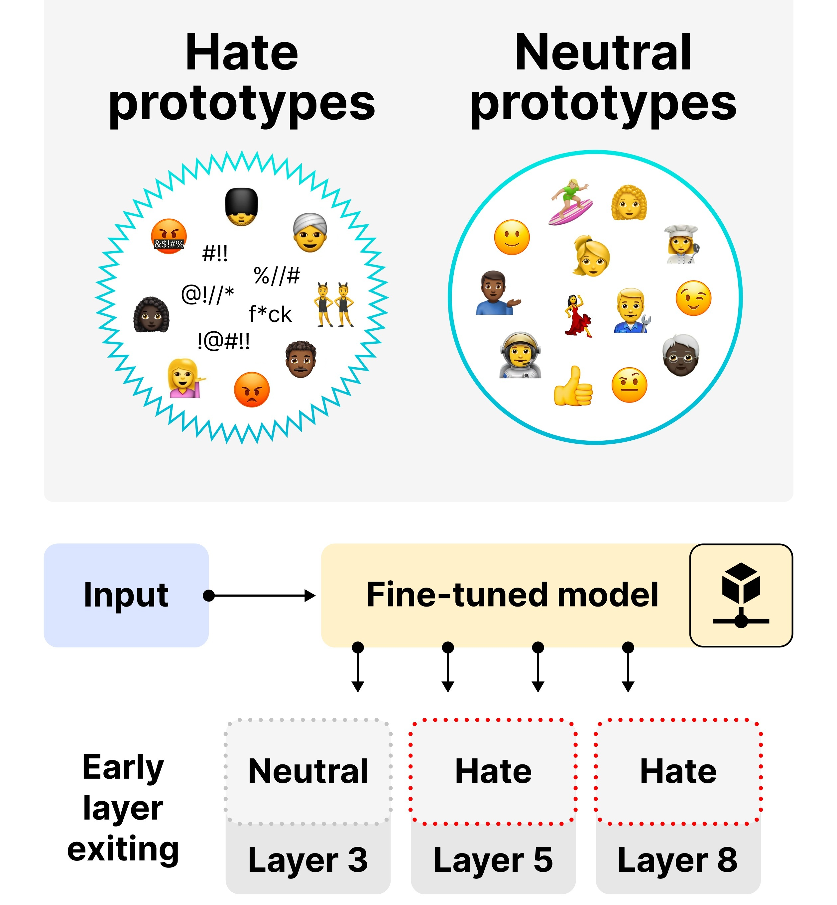
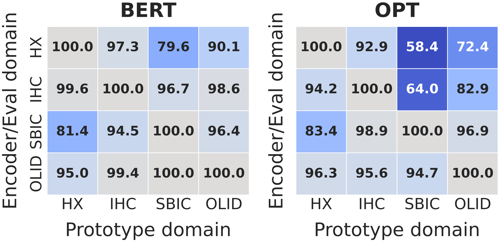

# LREC 2026 | HatePrototypes: Interpretable and Transferable Representations for Hate Speech Detection

<p>
  <a href="https://huggingface.co/papers/2511.06391">
    
  </a>
  <a href="https://arxiv.org/abs/2511.06391">
    
  </a>
  <a href="figures/poster_470.pdf">
    
  </a>
  <a href="https://lrec.elra.info/lrec2026-main-343">
    
  </a>
  <a href="https://github.com/upunaprosk/hate-prototypes/actions/workflows/tests.yml">
    
  </a>
</p>

Official implementation, datasets, evaluation scripts, and reproduction utilities for:

**[HatePrototypes: Interpretable and Transferable Representations for Implicit and Explicit Hate Speech Detection](https://arxiv.org/abs/2511.06391)**

**Irina Proskurina, Marc-Antoine Carpentier, Julien Velcin**

*Proceedings of LREC 2026, pp. 4387–4399*
[DOI: 10.63317/3opu4zq9p6pc](https://doi.org/10.63317/3opu4zq9p6pc)

---

## 🔥 News

* **14 May 2026:** 🎉 Presented at LREC 2026 in Palma de Mallorca. [Proceedings](https://lrec.elra.info/lrec2026-main-343)
* **26 February 2026:** 🔥 Official code and data release.
* **12 February 2026:** ✨ Accepted to LREC 2026.

---

<p align="center">
  
</p>

> Current approaches to hate speech detection, particularly for implicit or indirect expressions of hate, often depend on repeated pre-training or fine-tuning of language models on newly collected datasets.
>
> We introduce **HatePrototypes**, class-level vector representations derived from models optimized for hate speech detection and safety moderation. Prototypes built from as few as **50 labeled examples per class** enable cross-dataset transfer between explicit and implicit hate benchmarks, and support parameter-free classification and early exiting.

---

## Main Results

### Prototype Transfer

For evaluation domain `X` and prototype source domain `Y`, relative transfer performance is:

```math
\frac{F1(X \mid proto(Y))}{F1(X \mid proto(X))}
```

<p align="center">
  
</p>

Prototypes constructed from other datasets retain a substantial fraction of in-domain performance. The OLID-tuned model retains **95–100%** of the in-domain macro-F1 for several prototype sources.

### Guard Models

We additionally evaluate:

* [LLaMA-Guard-1B](https://huggingface.co/meta-llama/Llama-Guard-3-1B)
* [BLOOMz-3B-Guard](https://huggingface.co/cmarkea/bloomz-3b-guardrail)

<p align="center">
  
</p>

Largest reported improvements include:

* **SBIC + LLaMA-Guard:** 52.14 → 70.33 macro-F1
* **IHC + BLOOMz-Guard:** 49.49 → 60.92 macro-F1

---

## Usage

Install from the repository root:

```
git clone https://github.com/upunaprosk/hate-prototypes.git
cd hate-prototypes
pip install -e ".[dev]"
```

The experiments use **HateXplain, SBIC, IHC, and OLID**. Processed splits are provided in `data/all_data_hate.zip`.

### Fine-tuning

Fine-tune BERT:

```
python model_finetuning.py \
  --model_name bert-base-cased \
  --datasets hatexplain,olid,ihc,sbic \
  --train_pattern "data/{ds}_train.csv" \
  --test_pattern "data/{ds}_test.csv" \
  --seeds 0,1,2,3,4 \
  --models_dir models
```

Fine-tune OPT:

```
python model_finetuning_opt.py \
  --datasets hatexplain,olid,ihc,sbic \
  --train_pattern "data/{ds}_train.csv" \
  --test_pattern "data/{ds}_test.csv" \
  --models_dir models
```

### Prototype transfer

BERT:

```
python hate_prototypes_bert.py \
  --datasets hatexplain olid sbic ihc \
  --seeds 0 1 2 3 4 \
  --model_pattern "models/bert-base-cased-{ds}-s{seed}" \
  --csv_train "data/{ds}_train.csv" \
  --csv_test "data/{ds}_test.csv" \
  --max_protos 500 \
  --out_dir results/prototypes-bert
```

OPT:

```
python hate_prototypes_opt.py \
  --datasets hatexplain olid sbic ihc \
  --seeds 0 1 2 3 4 \
  --model_pattern "models/opt-125m-{ds}-s{seed}" \
  --csv_train "data/{ds}_train.csv" \
  --csv_test "data/{ds}_test.csv" \
  --max_protos 500 \
  --out_dir results/prototypes-opt
```

Generate the transfer heatmap:

```
python analyze_prototype_transfer.py \
  --seeds 0 1 2 3 4 \
  --proto_dir "results/prototypes-{model}" \
  --relative \
  --out_pdf figures/prototype_transfer.pdf
```

### Guard models

Example with BLOOMz-3B-Guard:

```
python prototypes_guardrail.py \
  --datasets hatexplain olid sbic ihc \
  --seeds 0 1 2 3 4 \
  --csv_train "data/{ds}_train.csv" \
  --csv_test "data/{ds}_test.csv" \
  --max_protos 500 \
  --out_dir results/prototypes-bloomz
```

### Early exiting

Entropy- and patience-based BERT baselines:

```
bash run_deebert_entropy.sh
bash run_deebert_patience.sh
```

Prototype-based early exiting is demonstrated in `notebooks/early_exiting_prototypes.ipynb`.

### Tests

```
pytest -v
ruff check src tests
```

--- 

# Citation

<br>

If you use HatePrototypes in your research, please cite:

```
@inproceedings{proskurina-etal-2026-hateprototypes,
  title = {HatePrototypes: Interpretable and Transferable Representations for Implicit and Explicit Hate Speech Detection},
  author = {Proskurina, Irina and Carpentier, Marc-Antoine and Velcin, Julien},
  booktitle = {Proceedings of the Fifteenth Language Resources and Evaluation Conference (LREC 2026)},
  month = {May},
  year = {2026},
  pages = {4387--4399},
  address = {Palma, Mallorca, Spain},
  publisher = {European Language Resources Association (ELRA)},
  editor = {Piperidis, Stelios and Bel, Núria and van den Heuvel, Henk and Ide, Nancy and Krek, Simon and Toral, Antonio},
  doi = {10.63317/3opu4zq9p6pc}
}
```

Citation metadata is also available in [`CITATION.cff`](CITATION.cff).


---

# License

<br>

See [`LICENSE`](LICENSE) for licensing information.

